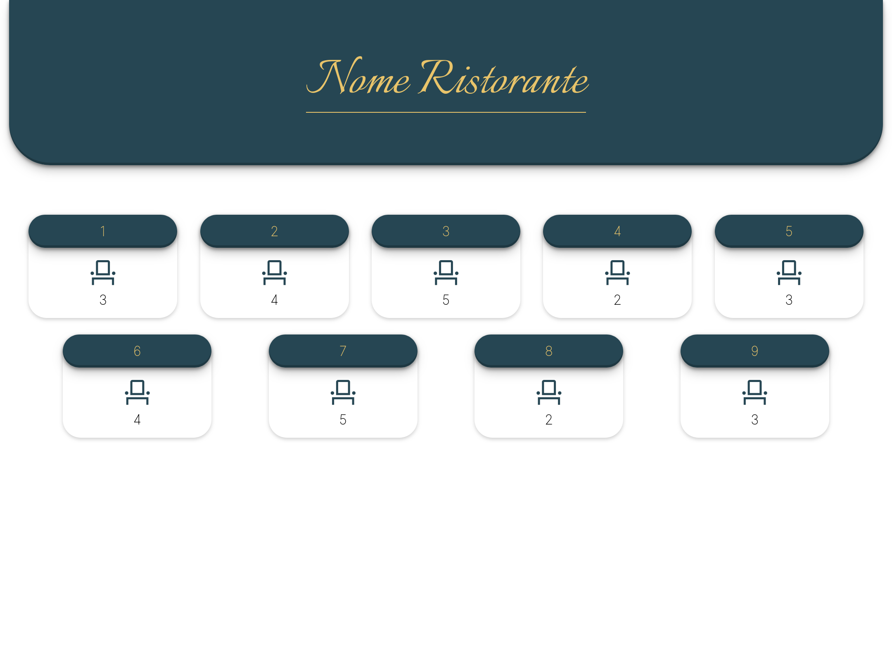
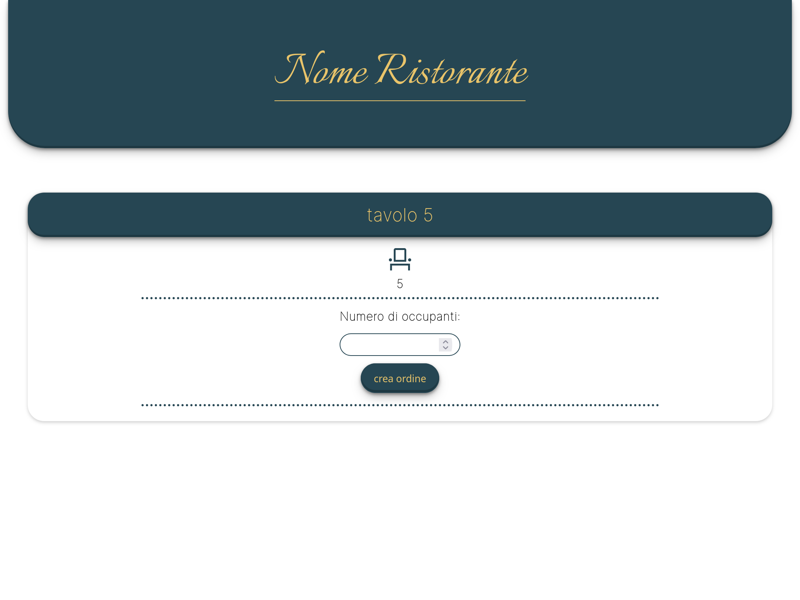

# Order Placement System

An Order placement system intended to help waitres place orders using a tablet. Developed using Express and Mongoose as a university project.

## Gallery
### Main view
<p align="center">
    
</p>

### Order placement view
<p align="center">
    
</p>

## Usage

```console
$ git clone https://github.com/giusgal/Order-placement-system.git
$ cd Order-placement-system
$ npm install
$ node server.js
```
