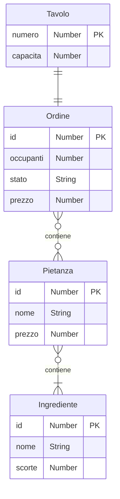

# ProgettoACP - Sistema gestione ristorante

## Test

## Screenshots

    

## Risorse
| Metodo    | Risorsa                                     | Descrizione                                                                     |
|-----------|---------------------------------------------|---------------------------------------------------------------------------------|
| GET       | /tavoli                                     | Restituisce le informazioni sui tavoli del ristorante                           |
| POST      | /tavoli/{numero}/ordine                     | Crea un nuovo ordine al tavolo identificato da {numero}                         |
| PUT       | /tavoli/{numero}/ordine/pietanze/{pietanza} | Inserisce la pietanza {pietanza} nell'ordine al tavolo identificato da {numero} |
| PUT       | /tavoli/{numero}/ordine/stato               | Aggiorna lo stato dell'ordine al tavolo identificato da {numero}                |
| DELETE    | /tavoli/{numero}/ordine/pietanze/{pietanza} | Elimina la pietanza {pietanza} dall'ordine al tavolo identificato da {numero}   |

## Diagramma ER

