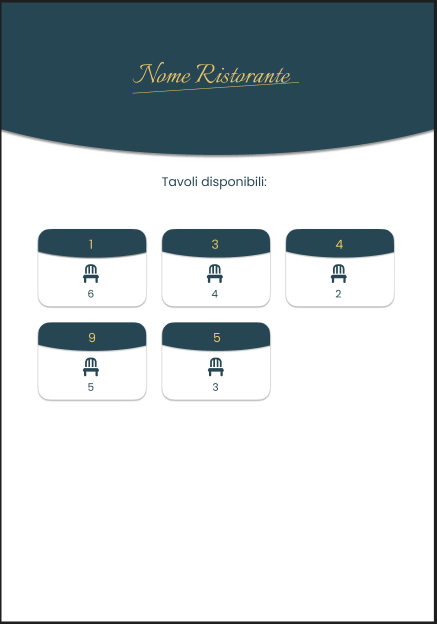
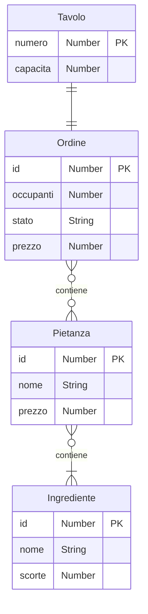

# Progetto ACP - Sistema gestione ristorante

    

## Risorse
| Metodo    | Risorsa                                     | Descrizione                                                                     |
|-----------|---------------------------------------------|---------------------------------------------------------------------------------|
| GET       | /tavoli                                     | Restituisce le informazioni sui tavoli del ristorante                           |
| PUT       | /tavoli/{numero}/ordine                     | Crea un nuovo ordine al tavolo identificato da {numero}. Il body del messaggio deve contenere il numero di occupanti del tavolo nel formato {'occupanti': \<num\>}.|
| POST      | /tavoli/{numero}/ordine/pietanze/{pietanza} | Inserisce la pietanza {pietanza} nell'ordine al tavolo identificato da {numero} |
| POST      | /tavoli/{numero}/ordine/stato               | Aggiorna lo stato dell'ordine al tavolo identificato da {numero}                |

## Codici di stato HTTP utilizzati
|           | GET /tavoli | PUT /tavoli/{numero}/ordine | POST /tavoli/{numero}/ordine/pietanze/{pietanza} | POST /tavoli/{numero}/ordine/stato |
|-----------|-------------|-----------------------------|--------------------------------------------------|------------------------------------|
|    200    |  richiesta servita correttamente | ordine creato correttamente | . | stato aggiornato correttamente |
|    422    | . | parametri non validi* | . | parametri non validi** |
|    500    | impossibile completare la richiesta | impossibile completare la richiesta | . | impossibile completare la richiesta |

## Diagramma ER

