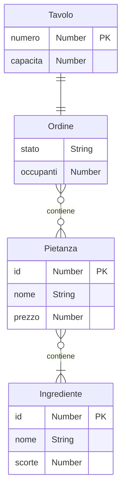

# Progetto ACP - Sistema gestione ristorante

<p align="center">
    
</p>

## Risorse
| Metodo    | Risorsa                                     | Descrizione                                                                     |
|-----------|---------------------------------------------|---------------------------------------------------------------------------------|
| GET       | /tavoli                                     | Restituisce le informazioni sui tavoli del ristorante                           |
| PUT       | /tavoli/{numero}/ordine                     | Crea un nuovo ordine al tavolo identificato da {numero}. Il body del messaggio deve contenere il numero di occupanti del tavolo nel formato {'occupanti': \<num\>}.|
| POST      | /tavoli/{numero}/ordine/pietanze/{pietanza} | Inserisce la pietanza {pietanza} nell'ordine al tavolo identificato da {numero} |
| POST      | /tavoli/{numero}/ordine/stato               | Aggiorna lo stato dell'ordine al tavolo identificato da {numero}                |

## Codici di stato HTTP utilizzati
Per ogni codice di stato sono specificate tutte le possibili risposte fornite dal server.
|   Codice  | GET /tavoli | PUT /tavoli/{numero}/ordine | POST /tavoli/{numero}/ordine/pietanze/{pietanza} | POST /tavoli/{numero}/ordine/stato |
|-----------|-------------|-----------------------------|--------------------------------------------------|------------------------------------|
|    200    |  JSON(tavoli) | ordine creato correttamente | JSON(pietanza_aggiunta) | JSON(stato_aggiornato) |
|    400    | . | numero del tavolo non valido, tavolo non esistente, numero di occupanti non valido, il numero di occupanti supera la capacità del tavolo, esiste un ordine aperto al tavolo selezionato  | numero del tavolo non valido, tavolo non esistente, id della pietanza non valido, ordine non presente o già confermato, pietanza non esistente, ingredienti non disponibili    | numero del tavolo non valido, tavolo non esistente, non esiste un ordine aperto al tavolo selezionato, impossibile modificare lo stato dell'ordine   |
|    500    | impossibile accedere ai dati richiesti | impossibile accedere ai dati richiesti | impossibile accedere ai dati richiesti | impossibile accedere ai dati richiesti, Problemi nel prenotare la pietanza riprova |

Nota:

1. Tutti i messaggi riportati vengono ritornati nel modo seguente:

    ```json
    {"message": "<msg>"}
    ```


## Diagramma ER

